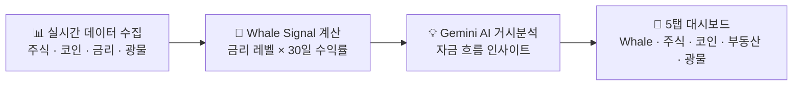
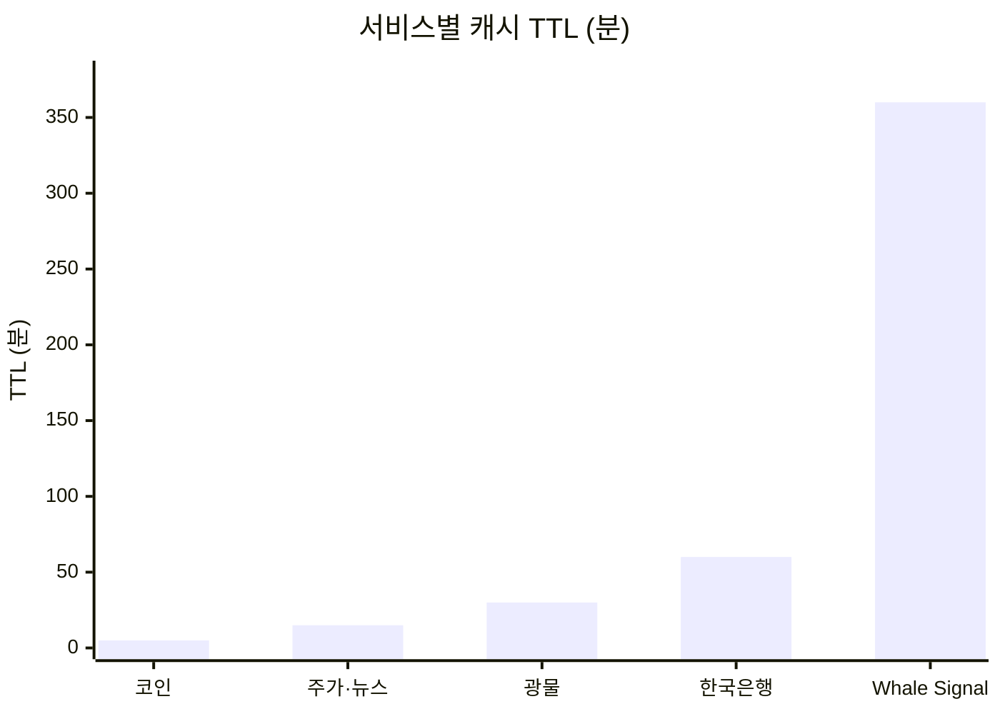
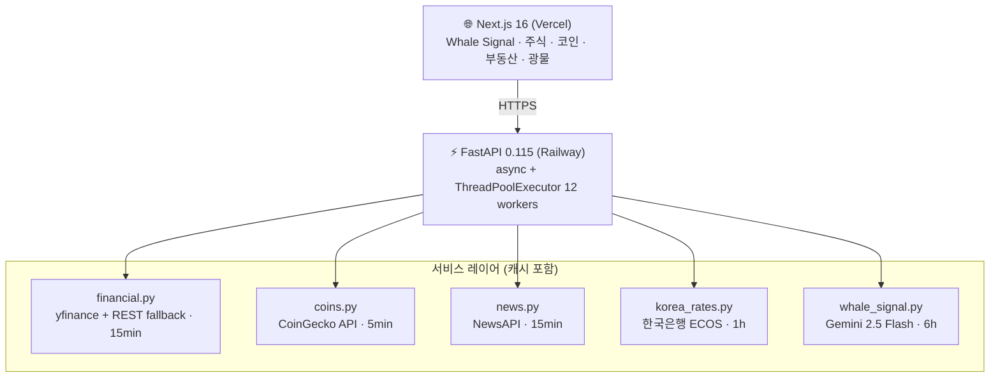

# Whalyx — Whale Tracker

[](https://www.python.org/)
[](https://nextjs.org/)
[](https://fastapi.tiangolo.com/)
[](https://ai.google.dev/)
[](https://railway.app/)
[](https://vercel.com/)

🐋 [whalyx.vercel.app](https://whalyx.vercel.app) · ⚡ [API Docs](https://shimmering-smile-production-afa2.up.railway.app/docs)

---

금리가 오르면 채권이 유리하고, 달러가 강해지면 신흥국 자산이 위험해진다. 이 판단을 하려면 Fed 금리, 주식, 코인, 부동산, 광물 데이터를 여러 사이트에서 직접 수집해야 했다. 세계 최고의 투자자들이 지금 어디에 돈을 넣고 있는지 한눈에 볼 수 있는 곳은 없었다.

거대한 돈의 흐름을 읽을 수 있다면 투자 판단이 달라질 수 있다고 생각했다. 그래서 만들었다.

---

## 버전 히스토리

| 버전 | 날짜 | 내용 |
|------|------|------|
| v1.1 | 2026-03-26 | recharts 반원 게이지, 다크/라이트 모드, 이모지 제거, Fed 금리 실시간 연동, 모바일 반응형, 퀵스탯 티커바 |
| v1.0 | 2026-03-24 | 최초 배포 — 8인 투자자 13F 추적, 핫 종목 TOP 12, AI 거시분석, 코인·부동산·돈의 흐름 대시보드 |

---

## 어떤 정보를 보여주는가

중심은 **Whale Signal** — 금리 환경과 주요 자산군의 30일 수익률을 결합해 5단계 투자 신호(Strong Buy / Buy / Neutral / Avoid / Super Sell)를 자동으로 계산한다. 여기에 Gemini AI가 거시경제 상황을 분석해 "지금 거대한 돈이 어디로 이동하는가"를 요약해준다.



주식 탭에서는 Warren Buffett, Cathie Wood, Michael Burry 등 8인의 전문 투자자 포트폴리오를 SEC 13F 공시 기준으로 추적한다. 복수의 투자자가 동시에 매수 중인 종목은 자동으로 집계되어 추천 신호로 표시된다.

| 투자자 | 소속 | 스타일 |
|--------|------|--------|
| Warren Buffett | Berkshire Hathaway | 가치투자 |
| Cathie Wood | ARK Invest | 혁신성장 |
| Michael Burry | Scion Asset Mgmt | 역발상 |
| Ray Dalio | Bridgewater Associates | 매크로·분산 |
| Stanley Druckenmiller | Duquesne Family Office | 기술주·매크로 |
| Bill Ackman | Pershing Square | 행동주의 |
| George Soros | Soros Fund Mgmt | 글로벌 매크로 |
| David Tepper | Appaloosa Management | 이벤트 드리븐 |

---

## 만들면서 부딪힌 문제들

**속도 문제.** 주식 종목 수십 개를 순차적으로 조회하면 초당 0.5초씩 쌓여 체감 로딩이 수십 초에 달했다. Yahoo Finance는 한국 IP에서 직접 호출하면 429 에러를 반환하기도 했다. `ThreadPoolExecutor` 12개로 병렬화하고 REST 폴백을 추가하는 것으로 해결했다. 초기 로딩이 80% 단축됐다.

**외부 API 비용 문제.** Gemini, NewsAPI, CoinGecko 모두 무료 티어에는 분당·일별 요청 한도가 있다. 서비스별 데이터 변동 주기를 분석해 TTL을 다르게 설정했다. 코인은 5분, 주가는 15분, Whale Signal은 6시간. 실시간성과 비용을 동시에 잡았고 운영 비용은 $0/month다.



**한국 금리 데이터 부재.** 외국 서비스들은 Fed 금리만 다루지, 한국은행 기준금리나 국고채 금리를 실시간으로 제공하는 곳이 없었다. 한국은행 ECOS API를 직접 연동해 기준금리·국고채 3년/10년·CD금리·원달러 환율을 한 화면에서 볼 수 있게 했다.

---

## 시스템 구조

백엔드는 FastAPI, 프론트는 Next.js. 두 서버는 각각 Railway와 Vercel에 배포되어 있다. 모든 외부 데이터 조회는 서비스 레이어에서 캐시와 함께 처리된다.



```
GET /investors               # 8인 전문 투자자 포트폴리오
GET /stocks/recommendations  # 매수/매도 추천 신호
GET /stocks/hot              # 고래 핫 종목 TOP 12
GET /stocks/{ticker}         # 종목 상세 + 차트 + AI 분석
GET /crypto                  # 코인 시세 + 뉴스
GET /realestate              # 한국 부동산 지표
GET /commodities             # 광물·원자재 시세
GET /money-flow              # 자산군 수익률 + 금리 신호
GET /whale-signal            # 5단계 투자 신호 + Gemini 거시분석
GET /korea-rates             # 한국은행 기준금리·국고채·환율
```

---

## 기술 스택

| 영역 | 기술 | 선택 이유 |
|------|------|-----------|
| Backend | FastAPI + Python 3.11 | async 지원, 자동 OpenAPI 문서 |
| Frontend | Next.js 16 + TypeScript | App Router, 정적 최적화 |
| AI | Gemini 2.5 Flash | 무료 티어, 긴 컨텍스트 |
| 주가 | yfinance + Yahoo Finance REST | 무료, REST 폴백으로 IP 차단 우회 |
| 코인 | CoinGecko API v3 | 무료, sparkline 지원 |
| 뉴스 | NewsAPI | 다국어 지원, URL 기준 중복 제거 |
| 한국 금리 | 한국은행 ECOS API | 기준금리·국고채·원달러 환율 |
| 차트 | Recharts | React 네이티브, 커스텀 가능 |
| 배포 | Railway (BE) + Vercel (FE) | 무료 티어 프로덕션 지원 |

---

이 프로젝트 전체는 Claude Code 3-Agent 오케스트레이션(PM + Backend Dev + Frontend Dev)으로 개발됐다. PO는 방향만 제시했고, 에이전트 팀이 API 계약을 먼저 정의한 뒤 백엔드와 프론트를 병렬로 구현했다.

---

## 로컬 실행

```bash
cp backend/.env.example backend/.env
# GEMINI_API_KEY, NEWS_API_KEY, BOK_API_KEY 입력

pip install -r backend/requirements.txt
python -m uvicorn backend.api.main:app --reload --port 8000

cd frontend && npm install
NEXT_PUBLIC_API_URL=http://localhost:8000 npm run dev
```
