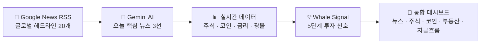
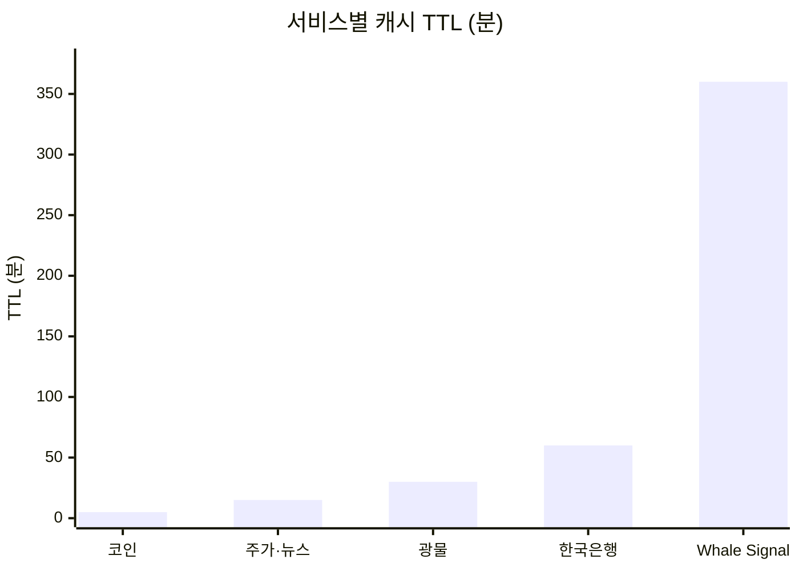
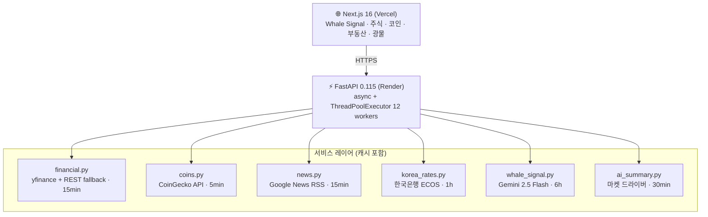
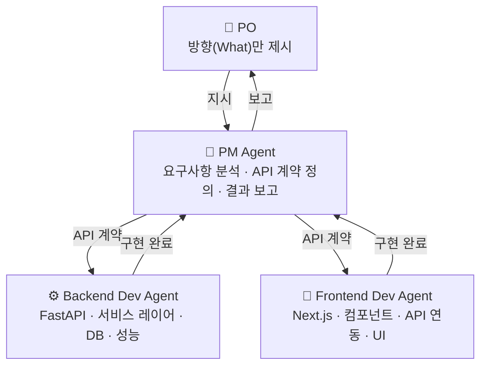
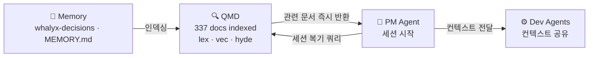

# Whalyx

[](https://www.python.org/)
[](https://nextjs.org/)
[](https://fastapi.tiangolo.com/)
[](https://ai.google.dev/)
[](https://render.com/)
[](https://vercel.com/)

🐋 [whalyx.vercel.app](https://whalyx.vercel.app) · ⚡ [API Docs](https://whalyx.onrender.com/docs)

---

뉴스 하나가 시장을 바꾼다. 이란-미국 협상, Fed 발언, 반도체 규제 — 이런 변수들이 터지는 순간, 어떤 자산이 오르고 어떤 자산이 내려갈지 빠르게 판단해야 한다. 그런데 뉴스, 주식, 코인, 부동산, 자금흐름을 한곳에서 볼 수 있는 곳은 없었다.

AI가 오늘의 핵심 뉴스를 골라주고, 그에 따른 자산 변화를 한 화면에서 볼 수 있다면 투자 판단이 달라질 수 있다고 생각했다. 그래서 만들었다.

---

## 버전 히스토리

| 버전 | 날짜 | 내용 |
|------|------|------|
| v1.3 | 2026-04-07 | 주식 상세 모달 전면 개편 — 5기간 차트(1일/1주/1개월/3개월/1년), 핵심 지표 12개 그리드(시가총액·P/E·EPS·52주 H/L·베타·배당·거래량·PBR), 재무 지표(매출·이익률·ROE), 애널리스트 컨센서스+목표주가, 기업 소개, Supabase 펀더멘털 24h 캐시 |
| v1.2.2 | 2026-04-07 | 오늘의 투자포인트 종목 카드 KRW 환율 표시 추가 (원화 전액, 천 단위 콤마), 로고 클릭 → 메인 이동, CoinGecko 429 재시도 로직 개선 |
| v1.2.1 | 2026-04-07 | CoinGecko UA 브라우저로 변경·재시도·TTL 10분, Yahoo Finance workers 5개로 제한 |
| v1.2 | 2026-04-07 | 오늘의 투자포인트 페이지 추가 — S&P 500 50종목 AI 분석(FinBERT 감성 + Gemini 이유), 매수·매도·관심 3×3 그리드, 메인(`/`) 교체 및 기존 대시보드 `/dashboard`로 이동 |
| v1.1 | 2026-03-26 | recharts 반원 게이지, 다크/라이트 모드, 이모지 제거, Fed 금리 실시간 연동, 모바일 반응형, 퀵스탯 티커바 |
| v1.4 | 2026-04-08 | Google News RSS 전환(실시간), 마켓 드라이버 3선 — Gemini가 오늘 시장 핵심 뉴스 자동 선정, Railway → Render 무료 마이그레이션, Supabase DB 캐시 추가, google-genai SDK 전환 |
| v1.0 | 2026-03-24 | 최초 배포 — 투자자 포트폴리오 추적, 핫 종목 TOP 12, AI 거시분석, 코인·부동산·돈의 흐름 대시보드 |

---

## 어떤 정보를 보여주는가

매일 아침 Gemini가 글로벌 뉴스 20개를 읽고 오늘 시장을 가장 크게 움직이는 뉴스 3개를 골라준다. bullish / bearish / mixed 판단과 함께 어떤 자산에 어떤 영향을 주는지 한 문장으로 요약한다. 여기에 **Whale Signal** — 금리 환경과 주요 자산군의 30일 수익률을 결합한 5단계 투자 신호(Strong Buy / Buy / Neutral / Avoid / Super Sell) 가 붙는다.



주식 탭에서는 Warren Buffett, Cathie Wood, Michael Burry 등 8인의 유명 투자자 포트폴리오를 추적한다. 복수의 투자자가 동시에 매수 중인 종목은 자동 집계되어 추천 신호로 표시된다.

| 투자자 | 소속 | 스타일 |
|--------|------|--------|
| Warren Buffett | Berkshire Hathaway | 가치투자 |
| Cathie Wood | ARK Invest | 혁신성장 |
| Michael Burry | Scion Asset Mgmt | 역발상 |
| Ray Dalio | Bridgewater Associates | 매크로·분산 |
| Stanley Druckenmiller | Duquesne Family Office | 기술주·매크로 |
| Bill Ackman | Pershing Square | 행동주의 |
| George Soros | Soros Fund Mgmt | 글로벌 매크로 |
| David Tepper | Appaloosa Management | 이벤트 드리븐 |

---

## 만들면서 부딪힌 문제들

**속도 문제.** 주식 종목 수십 개를 순차적으로 조회하면 초당 0.5초씩 쌓여 체감 로딩이 수십 초에 달했다. Yahoo Finance는 한국 IP에서 직접 호출하면 429 에러를 반환하기도 했다. `ThreadPoolExecutor` 12개로 병렬화하고 REST 폴백을 추가하는 것으로 해결했다. 초기 로딩이 80% 단축됐다.

**외부 API 비용 문제.** Gemini, CoinGecko 모두 무료 티어에는 분당·일별 요청 한도가 있다. 서비스별 데이터 변동 주기를 분석해 TTL을 다르게 설정했다. 코인은 5분, 주가는 15분, 마켓 드라이버는 30분, Whale Signal은 6시간. 실시간성과 비용을 동시에 잡았고 운영 비용은 $0/month다.



**한국 금리 데이터 부재.** 외국 서비스들은 Fed 금리만 다루지, 한국은행 기준금리나 국고채 금리를 실시간으로 제공하는 곳이 없었다. 한국은행 ECOS API를 직접 연동해 기준금리·국고채 3년/10년·CD금리·원달러 환율을 한 화면에서 볼 수 있게 했다.

---

## 시스템 구조

백엔드는 FastAPI, 프론트는 Next.js. 두 서버는 각각 Railway와 Vercel에 배포되어 있다. 모든 외부 데이터 조회는 서비스 레이어에서 캐시와 함께 처리된다.



```
GET /market-driver           # 오늘 시장 핵심 뉴스 3선 (Gemini 선정)
GET /investors               # 8인 유명 투자자 포트폴리오
GET /stocks/recommendations  # 매수/매도 추천 신호
GET /stocks/hot              # 핫 종목 TOP 12
GET /stocks/{ticker}         # 종목 상세 + 차트 + AI 분석
GET /crypto                  # 코인 시세 + 뉴스
GET /realestate              # 한국 부동산 지표
GET /commodities             # 광물·원자재 시세
GET /money-flow              # 자산군 수익률 + 금리 신호
GET /whale-signal            # 5단계 투자 신호 + Gemini 거시분석
GET /korea-rates             # 한국은행 기준금리·국고채·환율
```

---

## 기술 스택

| 영역 | 기술 | 선택 이유 |
|------|------|-----------|
| Backend | FastAPI + Python 3.11 | async 지원, 자동 OpenAPI 문서 |
| Frontend | Next.js 16 + TypeScript | App Router, 정적 최적화 |
| AI | Gemini 2.5 Flash | 무료 티어, 긴 컨텍스트 |
| 주가 | yfinance + Yahoo Finance REST | 무료, REST 폴백으로 IP 차단 우회 |
| 코인 | CoinGecko API v3 | 무료, sparkline 지원 |
| 뉴스 | Google News RSS + feedparser | API 키 없이 실시간 헤드라인 |
| 한국 금리 | 한국은행 ECOS API | 기준금리·국고채·원달러 환율 |
| 차트 | Recharts | React 네이티브, 커스텀 가능 |
| 배포 | Render (BE) + Vercel (FE) | 무료 티어 프로덕션 지원 |

---

## Claude Agent Orchestration (CAO)

이 프로젝트 전체는 Claude Code 기반 CAO(Claude Agent Orchestration) 방식으로 개발됐다. 단순한 코드 자동완성이 아니라 PM·Backend Dev·Frontend Dev 3개의 역할을 Claude가 동시에 수행하면서, Claude Code CLI 자체를 개선하는 툴링 작업까지 포함한다.



**개발 방식.** PO가 기능 방향만 제시하면 PM Agent가 요구사항을 분석하고 API 인터페이스 계약을 먼저 정의한다. 계약이 확정되면 Backend Dev와 Frontend Dev가 병렬로 구현에 들어간다. PM이 통합 검증 후 PO에게만 결과를 보고한다. PO는 기술적 질문을 받지 않는다.

**적용 사례 — Whalyx 신규 기능 개발.** 코인 탭 추가, 돈의 흐름 탭, 오늘의 투자포인트 페이지 모두 이 방식으로 구현됐다. API 계약 먼저 → 백엔드·프론트 병렬 → 통합 순서를 지켰다.

**적용 사례 — 개발 환경 툴링 커스터마이징.** Claude Code의 터미널 상태바 플러그인(claude-hud)을 AI가 직접 커스터마이징한 사례다. PO가 이미지 하나를 참조로 제시하고 "이 방식으로 만들어달라"고 하자, PM이 플러그인 아키텍처(stdin JSON → TypeScript 렌더러 → stdout)를 분석했다. 이 과정에서 컨텍스트 윈도우 토큰과 5시간 사용 한도 토큰이 서로 다른 데이터 풀임을 파악하고 PO에게 설명했다. 최종적으로 새로운 `dashboard` 레이아웃 모드를 dist JS에 직접 구현했다. 결과물은 현재 모델명·컨텍스트 사용률·토큰 수·5h 사용률·주간 사용률을 2줄 대시보드 형태로 표시한다.

```
현재 모델              컨텍스트 사용률         토큰 수                 5h 사용률       주간 사용률
claude-sonnet-4-6      ▓▓▓▓▓▓▓▓▓░░░░░ 62%      124,800 / 200,000       35% (2h)        18% (26h)
```

**적용 사례 — 로컬 지식 베이스 QMD.** 프로젝트가 커질수록 이전 세션의 결정 사항을 기억하는 비용이 커졌다. 매번 파일을 다시 읽으면 토큰이 낭비되고, 기억에만 의존하면 같은 실수가 반복됐다. QMD(Quick Markdown Docs)는 로컬 LLM 기반 Markdown 검색 엔진이다. 337개의 프로젝트 문서를 인덱싱한 뒤 lex(BM25 키워드), vec(벡터 시맨틱), hyde(가상 답변 생성) 세 방식을 조합해 검색한다. PM Agent가 세션 시작 시 QMD로 아키텍처 결정 사항과 이전 작업 이력을 즉시 검색하면, 파일을 일일이 열지 않아도 이전 세션과 자연스럽게 이어진다.



세 가지 검색 방식의 조합이 핵심이다. lex는 함수명·버전처럼 정확한 단어가 있을 때, vec는 "코인 API 캐시 전략이 뭐였지"처럼 의미 기반으로 물을 때, hyde는 답변 형태를 먼저 써두고 유사한 문서를 찾을 때 쓴다. 세션을 재시작해도 이전 의사결정 맥락이 토큰 낭비 없이 복기된다.

**적용 사례 — read-once + diff 모드로 토큰 절약.** 같은 파일을 반복 수정할 때마다 전체를 다시 읽으면 200줄 파일 기준 ~2000 토큰이 그대로 소모된다. read-once는 Claude Code의 `PreToolUse` 훅으로 동작한다. Read 도구가 호출되기 전에 해당 파일이 이미 컨텍스트에 있는지 확인하고, 변경이 없으면 재읽기를 차단한다. 여기에 `READ_ONCE_DIFF=1` diff 모드를 추가하면 파일이 편집된 경우에도 변경된 부분만 diff로 표시한다. 3줄을 수정했다면 ~30 토큰만 소비한다. diff가 40줄을 넘으면 자동으로 전체 읽기로 폴백해 손해가 없다.

```
# diff 모드 적용 전 — 파일 전체 재읽기
200줄 파일 × 3회 수정 = ~6,000 토큰

# diff 모드 적용 후 — 변경분만 표시
최초 읽기 ~2,000 + diff 3줄 × 3회 = ~2,090 토큰  (65% 절약)
```

---

## 로컬 실행

```bash
cp backend/.env.example backend/.env
# GEMINI_API_KEY, BOK_API_KEY, SUPABASE_URL, SUPABASE_KEY 입력

pip install -r backend/requirements.txt
python -m uvicorn backend.api.main:app --reload --port 8000

cd frontend && npm install
NEXT_PUBLIC_API_URL=http://localhost:8000 npm run dev
```
