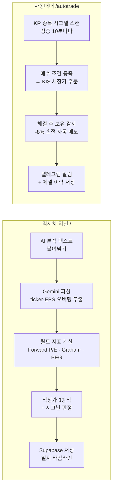
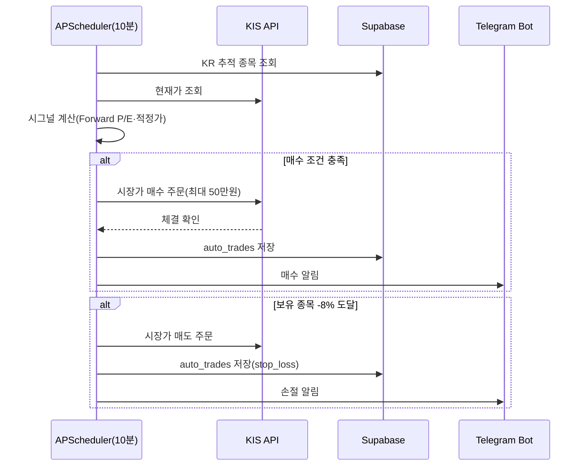
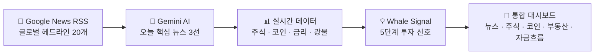
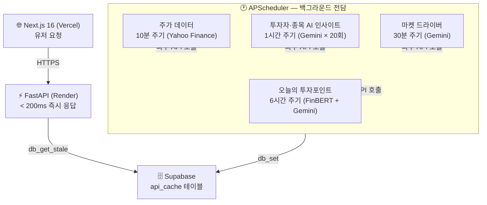
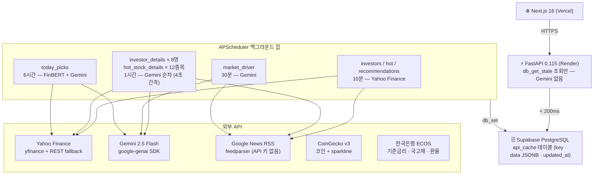
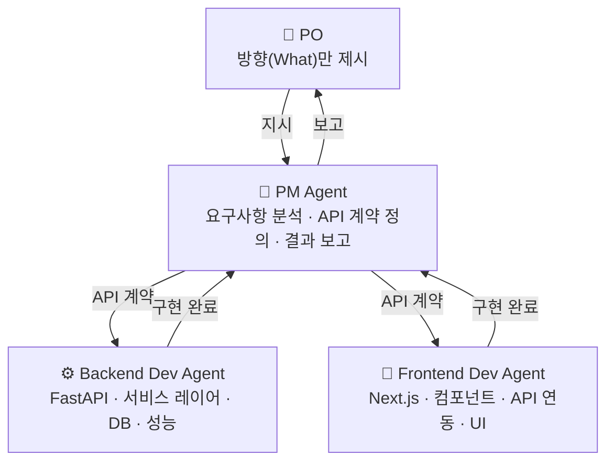
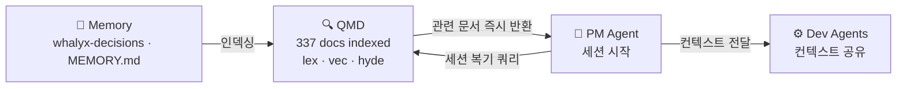

# Whalyx

[](https://www.python.org/)
[](https://nextjs.org/)
[](https://fastapi.tiangolo.com/)
[](https://ai.google.dev/)
[](https://render.com/)
[](https://vercel.com/)

🐋 [whalyx.vercel.app](https://whalyx.vercel.app) · ⚡ [API Docs](https://whalyx.onrender.com/docs)

---

뉴스 하나가 시장을 바꾼다. 이란-미국 협상, Fed 발언, 반도체 규제 — 이런 변수들이 터지는 순간, 어떤 자산이 오르고 어떤 자산이 내려갈지 빠르게 판단해야 한다. 그런데 뉴스, 주식, 코인, 부동산, 자금흐름을 한곳에서 볼 수 있는 곳은 없었다.

AI가 오늘의 핵심 뉴스를 골라주고, 그에 따른 자산 변화를 한 화면에서 볼 수 있다면 투자 판단이 달라질 수 있다고 생각했다. 그래서 만들었다.

---

## 버전 히스토리

| 버전 | 날짜 | 내용 |
|------|------|------|
| v3.10 | 2026-05-04 | 매수 시그널 인프라 정상화 — `finance-datareader` 0.9.93→>=0.9.110(KRX JSONDecodeError 수정), `_load_universe` 폴백 체인에 정적 JSON 추가(`backend/data/kr_universe.json`, KOSPI 200+KOSDAQ 100 시총 상위 300종목), `_ensure_universe`가 JSON에서 KOSPI 30+KOSDAQ 10을 워치리스트에 자동 보강(워치리스트 63→100+), `/autotrade/prescan` 백그라운드 fire-and-forget(Render proxy timeout 회피), `/autotrade/_debug/universe`·`/autotrade/scan-candidates` 진단 엔드포인트 추가 |
| v3.9 | 2026-05-04 | 종목 풀 확장 — `market_scanner` Redis 폴백 리팩터링(Supabase `market_universe` 테이블 의존 제거, Redis 7일 캐시 + Supabase best-effort 백업), `prescan_golden_cross` top_n 600, 시총 0종목 사전 제외, `_load_universe()` 자동 빌드 폴백으로 첫 호출 시 KOSPI+KOSDAQ 전종목 동기 → 평가 풀 63→200+ 종목 확장으로 골든크로스 발생 빈도 비례 증가 |
| v3.8 | 2026-04-30 | 로딩 UX 일관화 — 모든 페이지(dashboard·quant·autotrade·quant/stocks/[ticker]) 상단에 동일한 2px shimmer progress bar 적용, `loadingBar` keyframe을 globals.css로 통합해 4개 inline `<style>` 중복 제거 |
| v3.7 | 2026-04-30 | scan_log 보존 패치 — 장 외 시각 스캔(`status="skipped"`)이 장중 마지막 결과를 덮어쓰던 버그 수정(`quant_scheduler.scan_and_trade` finally 가드), 장 마감 후에도 그날 종목별 평가/탈락 사유 조회 가능 |
| v3.6 | 2026-04-30 | 대시보드 Quant 탭 스켈레톤 통일 — `QuantTab` 자동매매 유니버스 테이블(6행)·리서치 저널 목록(5행)·최근 체결(5행) 영역의 "불러오는 중..." 텍스트를 dashboard 공통 `.skeleton` shimmer 패턴으로 교체, 같은 페이지 내 다른 영역과 톤 일치 |
| v3.5 | 2026-04-30 | 로딩 스켈레톤 확대 — 리서치 저널(`/quant`) 종목 카드 5개 shimmer 스켈레톤, 종목 상세(`/quant/stocks/[ticker]`) 헤더·지표 그리드·테이블 스켈레톤, 모든 페이지 일관된 진행률 바·shimmer 애니메이션 적용 |
| v3.4 | 2026-04-30 | 매매 근거 로그 가시화 — 종목별 평가 결과(체결/거절 사유·재무필터·DART·뉴스차단 단계 표시)를 `/autotrade/scan-logs` 엔드포인트로 노출, 자동매매 화면에 ScanLogPanel 추가(전체/매수/거절 필터·60초 자동 갱신) / Cold Start UX 개선 — 로딩 중 경과시간 카운터·30초 이상 시 Render 콜드스타트 안내 메시지 자동 전환·pulse 애니메이션 |
| v3.3 | 2026-04-30 | 퀀트 파라미터 장기 표준 완화 — 손절 -5%→-7%·익절 +10%→+15%(1:2 RR), 동시 보유 5→8종목·섹터 한도 2→3, RSI 40~60→35~70(Wilder 원본), PER 5~30→5~35(Greenblatt Magic Formula) / 베어 레짐 매수 차단 버그 수정 — MTF 필터 베어장 완화(MA20≥MA60×0.9), Stage 5 모멘텀 임계값 -3%p 허용(반등 초기 진입 가능), 재무필터 중복 호출 제거 |
| v3.2 | 2026-04-29 | Regime Filter — KOSPI MA+VKOSPI 기반 bull/sideways/bear 국면 감지, 국면별 RSI·PER·거래량 파라미터 동적 적용 / DART 공시 연동 — 재무 필터 yfinance→DART 대체, 유상증자·전환사채 긴급차단 / 워치리스트 UI — 종목 추가·삭제·수정 모드, 종목명 자동 조회 / 타임존 버그 수정 — UTC→KST / 스켈레톤 로딩 UI |
| v3.0 | 2026-04-28 | Whalyx Quant 전환 — 퀀트 리서치 저널(AI 텍스트 파싱·Forward P/E·Graham Number·PEG 적정가·툴팁) + KIS 한국투자증권 Full-Auto 자동매매(장중 10분 스캔·-8% 손절·텔레그램 체결 알림) |
| v2.5 | 2026-04-20 | 텔레그램 봇 연동 — APScheduler cron으로 KST 07:00·12:00·18:00 하루 3회 글로벌 뉴스 5선 자동 발송 |
| v2.4 | 2026-04-13 | news_ai 안정화 — Gemini/JSON 파싱 실패 시 뉴스 데이터 보존(AI 요약 없이도 목록 표시), 뉴스 날짜 `updated` 우선 사용(입력일→업데이트일 수정), 프롬프트 경량화(20→15기사), 이모지 전면 제거 |
| v2.3 | 2026-04-13 | 메인 페이지 재설계 — 조선/동아일보 RSS 직접 파싱으로 이미지 포함 한국어 헤드라인, 헤드라인 더보기(3→10), 카테고리별 급등·급락 탭(주식/코인/광물/부동산) + 관련 뉴스, `/headlines` `/today-movers` 신규 엔드포인트, AI 분석(1h)과 헤드라인 갱신(5min) 분리 |
| v2.2 | 2026-04-13 | DB-Only 안정화 2차 — `generate_news_analysis` try/except 제거로 오류 dict DB 저장 방지, 카테고리 뉴스 한국어 우선 영어 폴백(`_ko_then_en`) |
| v2.1 | 2026-04-10 | 오늘의 투자포인트 뉴스 기반 전환 — S&P 500 FinBERT 파이프라인 제거, `/today-picks`를 `news_ai` 데이터 재활용으로 전환(처리시간 5~7분 → <200ms), 한국 경제뉴스 카테고리 추가(구글 뉴스 RSS 한국어), 자산군 탭 7개(전체/주식/코인/부동산/광물/채권/한국) |
| v2.0.1 | 2026-04-10 | DB-Only 안정화 — Gemini 503 UNAVAILABLE 재시도 로직 추가(20초 대기), scheduler `get_coin_markets()` sync→async 래핑 수정(unhashable list 버그 해소), `warm_all_caches` DB 미스 시 즉시 1회 트리거 추가(첫 배포 빈 화면 해결), NewsAISection TypeError 크래시 수정(null safety + 빈 상태 UI) |
| v2.0 | 2026-04-09 | DB-Only 아키텍처 전환 — APScheduler 도입, 모든 엔드포인트에서 Gemini 완전 제거, 유저 요청 시 Supabase만 읽어 < 200ms 즉시 응답, 투자자 8명·핫 종목 12개 Gemini 인사이트 1시간 주기 사전 갱신, Supabase api_cache 테이블 신규 구성 |
| v1.4 | 2026-04-08 | Google News RSS 전환(실시간), 마켓 드라이버 3선 — Gemini가 오늘 시장 핵심 뉴스 자동 선정, Railway → Render 무료 마이그레이션, Supabase DB 캐시 추가, google-genai SDK 전환 |
| v1.3 | 2026-04-07 | 주식 상세 모달 전면 개편 — 5기간 차트(1일/1주/1개월/3개월/1년), 핵심 지표 12개 그리드(시가총액·P/E·EPS·52주 H/L·베타·배당·거래량·PBR), 재무 지표(매출·이익률·ROE), 애널리스트 컨센서스+목표주가, 기업 소개, Supabase 펀더멘털 24h 캐시 |
| v1.2.2 | 2026-04-07 | 오늘의 투자포인트 종목 카드 KRW 환율 표시 추가 (원화 전액, 천 단위 콤마), 로고 클릭 → 메인 이동, CoinGecko 429 재시도 로직 개선 |
| v1.2.1 | 2026-04-07 | CoinGecko UA 브라우저로 변경·재시도·TTL 10분, Yahoo Finance workers 5개로 제한 |
| v1.2 | 2026-04-07 | 오늘의 투자포인트 페이지 추가 — S&P 500 50종목 AI 분석(FinBERT 감성 + Gemini 이유), 매수·매도·관심 3×3 그리드, 메인(`/`) 교체 및 기존 대시보드 `/dashboard`로 이동 |
| v1.1 | 2026-03-26 | recharts 반원 게이지, 다크/라이트 모드, 이모지 제거, Fed 금리 실시간 연동, 모바일 반응형, 퀵스탯 티커바 |
| v1.0 | 2026-03-24 | 최초 배포 — 투자자 포트폴리오 추적, 핫 종목 TOP 12, AI 거시분석, 코인·부동산·돈의 흐름 대시보드 |

---

## v3.0 — Whalyx Quant: 퀀트 트레이딩 시스템

v3.0에서 방향이 바뀌었다. 뉴스 기반 감성 분석은 시장 분위기를 파악하는 데 유용하지만, 개별 종목의 내재 가치를 숫자로 따지는 데는 한계가 있다. 퀀트 트레이딩은 감정을 배제하고 재무제표 데이터를 수학적 규칙으로 바꿔 매매 신호를 만드는 것에서 시작한다.

Whalyx Quant는 두 모듈로 분리된다.



**리서치 저널**은 사용자가 직접 분석한 내용을 기록하는 곳이다. Gemini나 ChatGPT로 재무제표를 분석한 텍스트를 그대로 붙여넣으면, 백엔드 Gemini가 ticker·현재가·EPS·오버행 리스크를 자동으로 파싱한다. 파싱된 데이터로 세 가지 적정가를 계산한다.

| 방식 | 공식 | 특징 |
|------|------|------|
| P/E 기반 | target P/E × Forward EPS | 가장 직관적 |
| Graham Number | √(22.5 × EPS × BPS) | 벤저민 그레이엄 보수적 기준 |
| PEG 기반 | EPS 성장률 × EPS | 고성장주에 유리 |

세 방식의 평균이 종합 적정가가 되고, 현재가와의 괴리율로 매수/보류/매도 시그널이 결정된다. 모든 지표에는 툴팁이 달려 있어 Forward P/E, Graham Number, 오버행 같은 개념을 hover 시 한국어로 설명해준다.

**자동매매 모듈**은 KIS(한국투자증권) REST API로 실제 주문을 실행한다. APScheduler가 장중 10분마다 한국 추적 종목의 시그널을 재계산하고, 매수 조건이 충족되면 종목당 최대 50만 원 한도로 시장가 주문을 낸다. 보유 종목은 실시간으로 수익률을 감시하다가 -8%에 도달하면 자동 손절한다. 체결마다 텔레그램 봇(`@Whalyx_bot`)으로 알림이 온다.



두 모듈의 데이터는 Supabase 세 테이블(`quant_stocks`, `journal_entries`, `auto_trades`)에 분리 저장되고, 레거시 백엔드(뉴스·코인·부동산 라우터)는 삭제하지 않고 그대로 보존한다.

**매매 유니버스 구성.** 자동매매 스캐너는 두 소스를 합쳐서 신호를 계산한다.

| 소스 | 테이블 | 추가 방법 | UI 표시 |
|------|--------|----------|---------|
| 내 워치리스트 | `autotrade_watchlist` | /autotrade 워치리스트 관리 | - |
| 리서치 저널 | `quant_stocks` | /quant 저널 텍스트 붙여넣기 | 내종목 뱃지 |

리서치 저널에서 분석한 종목은 자동으로 매매 대상에 포함된다. 5단계 재무 필터·DART 긴급차단·뉴스 감성 분석을 동일하게 통과해야 실제 주문이 실행된다.

**Regime Filter.** KOSPI MA20/MA60 추세와 VKOSPI 변동성 지수를 결합해 시장 국면을 bull / sideways / bear 세 단계로 분류한다. 국면에 따라 RSI 허용 범위, PER 상한, 거래량 기준, 코스피 하락 차단 임계치가 자동으로 조정된다.

| 국면 | RSI 범위 | PER 상한 | 거래량 기준 | 코스피 차단 |
|------|---------|---------|-----------|-----------|
| bull | 40~80 | 45 | ×1.2 | -2.5% |
| sideways | 40~65 | 30 | ×1.5 | -1.5% |
| bear | 35~55 | 20 | ×2.0 | -1.0% |

---

## 준비 중

**해외주식 동시 운용.** 현재는 KIS Open API 단일 계좌(KR)로 운용 중이다. 해외주식(US) 자동매매는 별도 종합매매계좌 개설 후 아래 환경변수를 추가하면 활성화된다.

```bash
# Render 환경변수 추가 예정
KIS_US_ACCOUNT_NO=해외주식계좌번호
KIS_US_APP_KEY=해외계좌용앱키
KIS_US_APP_SECRET=해외계좌용시크릿
```

KIS Open API는 앱키 1세트 = 계좌 1개에 연결되므로, KR·US 각각 별도 앱키가 필요하다. 코드상 `get_us_holdings()`, `buy_us_market_order()` 등 US 함수를 별도 토큰/계좌로 분리하는 작업이 남아있다.

---

## 어떤 정보를 보여주는가

매일 아침 Gemini가 글로벌 뉴스 20개를 읽고 오늘 시장을 가장 크게 움직이는 뉴스 3개를 골라준다. bullish / bearish / mixed 판단과 함께 어떤 자산에 어떤 영향을 주는지 한 문장으로 요약한다. 여기에 **Whale Signal** — 금리 환경과 주요 자산군의 30일 수익률을 결합한 5단계 투자 신호(Strong Buy / Buy / Neutral / Avoid / Super Sell) 가 붙는다.



주식 탭에서는 Warren Buffett, Cathie Wood, Michael Burry 등 8인의 유명 투자자 포트폴리오를 추적한다. 복수의 투자자가 동시에 매수 중인 종목은 자동 집계되어 추천 신호로 표시된다.

| 투자자 | 소속 | 스타일 |
|--------|------|--------|
| Warren Buffett | Berkshire Hathaway | 가치투자 |
| Cathie Wood | ARK Invest | 혁신성장 |
| Michael Burry | Scion Asset Mgmt | 역발상 |
| Ray Dalio | Bridgewater Associates | 매크로·분산 |
| Stanley Druckenmiller | Duquesne Family Office | 기술주·매크로 |
| Bill Ackman | Pershing Square | 행동주의 |
| George Soros | Soros Fund Mgmt | 글로벌 매크로 |
| David Tepper | Appaloosa Management | 이벤트 드리븐 |

---

## 만들면서 부딪힌 문제들

**유저 요청마다 AI를 호출하는 구조의 한계.** 초기에는 유저가 페이지를 열 때 Gemini를 직접 호출했다. 마켓 드라이버 33초, 오늘의 투자포인트는 7분이 넘어 Render의 60초 타임아웃에 강제 종료됐다. 근본 원인은 구조였다 — 유저 요청이 곧 AI 호출이었다.

해결책은 역할 분리였다. APScheduler로 백그라운드 스케줄러를 별도로 두고, 외부 API와 Gemini 호출은 전부 스케줄러가 담당하게 했다. 엔드포인트는 Supabase에서만 읽는다. 유저 요청이 들어오는 순간 DB 조회만 하기 때문에 응답 시간이 < 200ms로 고정된다.



Gemini는 오직 스케줄러에서만 호출된다. 엔드포인트와 서버 재시작(warm_all_caches)에서는 Gemini를 부르지 않는다. redeploy가 잦아도 레이트 리밋이 걸리지 않는다.

**속도 문제.** 주식 종목 수십 개를 순차적으로 조회하면 초당 0.5초씩 쌓여 체감 로딩이 수십 초에 달했다. Yahoo Finance는 한국 IP에서 직접 호출하면 429 에러를 반환하기도 했다. `ThreadPoolExecutor` 12개로 병렬화하고 REST 폴백을 추가하는 것으로 해결했다. 초기 로딩이 80% 단축됐다.

**외부 API 레이트 리밋.** Gemini 무료 티어는 분당 10 RPM 제한이 있다. 스케줄러에서 투자자 8명·핫 종목 12개를 순차 처리할 때 각 호출 사이에 4초 간격을 두었다. 20회 호출이 80초에 걸쳐 분산되어 분당 최대 15회를 넘지 않는다. 429 발생 시에는 에러 메시지에서 `retry in Xs`를 파싱해 자동으로 대기 후 최대 3회 재시도한다.

**한국 금리 데이터 부재.** 외국 서비스들은 Fed 금리만 다루지, 한국은행 기준금리나 국고채 금리를 실시간으로 제공하는 곳이 없었다. 한국은행 ECOS API를 직접 연동해 기준금리·국고채 3년/10년·CD금리·원달러 환율을 한 화면에서 볼 수 있게 했다.

---

## 시스템 구조

백엔드는 FastAPI, 프론트는 Next.js. Render(BE)와 Vercel(FE)에 배포된다. v2.0부터 DB-Only 아키텍처로 전환했다 — 엔드포인트는 Supabase만 읽고, 외부 API·AI 호출은 APScheduler 백그라운드 잡이 전담한다.



```
GET /market-driver           # 오늘 시장 핵심 뉴스 3선 (Gemini 선정)
GET /investors               # 8인 유명 투자자 포트폴리오
GET /stocks/recommendations  # 매수/매도 추천 신호
GET /stocks/hot              # 핫 종목 TOP 12
GET /stocks/{ticker}         # 종목 상세 + 차트 + AI 분석
GET /crypto                  # 코인 시세 + 뉴스
GET /realestate              # 한국 부동산 지표
GET /commodities             # 광물·원자재 시세
GET /money-flow              # 자산군 수익률 + 금리 신호
GET /whale-signal            # 5단계 투자 신호 + Gemini 거시분석
GET /korea-rates             # 한국은행 기준금리·국고채·환율
```

---

## 기술 스택

| 영역 | 기술 | 선택 이유 |
|------|------|-----------|
| Backend | FastAPI + Python 3.11 | async 지원, 자동 OpenAPI 문서 |
| Frontend | Next.js 16 + TypeScript | App Router, 정적 최적화 |
| AI | Gemini 2.5 Flash | 무료 티어, 긴 컨텍스트 |
| 주가 | yfinance + Yahoo Finance REST | 무료, REST 폴백으로 IP 차단 우회 |
| 코인 | CoinGecko API v3 | 무료, sparkline 지원 |
| 뉴스 | Google News RSS + feedparser | API 키 없이 실시간 헤드라인 |
| 한국 금리 | 한국은행 ECOS API | 기준금리·국고채·원달러 환율 |
| 차트 | Recharts | React 네이티브, 커스텀 가능 |
| 배포 | Render (BE) + Vercel (FE) | 무료 티어 프로덕션 지원 |

---

## Claude Agent Orchestration (CAO)

이 프로젝트 전체는 Claude Code 기반 CAO(Claude Agent Orchestration) 방식으로 개발됐다. 단순한 코드 자동완성이 아니라 PM·Backend Dev·Frontend Dev 3개의 역할을 Claude가 동시에 수행하면서, Claude Code CLI 자체를 개선하는 툴링 작업까지 포함한다.



**개발 방식.** PO가 기능 방향만 제시하면 PM Agent가 요구사항을 분석하고 API 인터페이스 계약을 먼저 정의한다. 계약이 확정되면 Backend Dev와 Frontend Dev가 병렬로 구현에 들어간다. PM이 통합 검증 후 PO에게만 결과를 보고한다. PO는 기술적 질문을 받지 않는다.

**적용 사례 — Whalyx 신규 기능 개발.** 코인 탭 추가, 돈의 흐름 탭, 오늘의 투자포인트 페이지 모두 이 방식으로 구현됐다. API 계약 먼저 → 백엔드·프론트 병렬 → 통합 순서를 지켰다.

**적용 사례 — 개발 환경 툴링 커스터마이징.** Claude Code의 터미널 상태바 플러그인(claude-hud)을 AI가 직접 커스터마이징한 사례다. PO가 이미지 하나를 참조로 제시하고 "이 방식으로 만들어달라"고 하자, PM이 플러그인 아키텍처(stdin JSON → TypeScript 렌더러 → stdout)를 분석했다. 이 과정에서 컨텍스트 윈도우 토큰과 5시간 사용 한도 토큰이 서로 다른 데이터 풀임을 파악하고 PO에게 설명했다. 최종적으로 새로운 `dashboard` 레이아웃 모드를 dist JS에 직접 구현했다. 결과물은 현재 모델명·컨텍스트 사용률·토큰 수·5h 사용률·주간 사용률을 2줄 대시보드 형태로 표시한다.

```
현재 모델              컨텍스트 사용률         토큰 수                 5h 사용률       주간 사용률
claude-sonnet-4-6      ▓▓▓▓▓▓▓▓▓░░░░░ 62%      124,800 / 200,000       35% (2h)        18% (26h)
```

**적용 사례 — 로컬 지식 베이스 QMD.** 프로젝트가 커질수록 이전 세션의 결정 사항을 기억하는 비용이 커졌다. 매번 파일을 다시 읽으면 토큰이 낭비되고, 기억에만 의존하면 같은 실수가 반복됐다. QMD(Quick Markdown Docs)는 로컬 LLM 기반 Markdown 검색 엔진이다. 337개의 프로젝트 문서를 인덱싱한 뒤 lex(BM25 키워드), vec(벡터 시맨틱), hyde(가상 답변 생성) 세 방식을 조합해 검색한다. PM Agent가 세션 시작 시 QMD로 아키텍처 결정 사항과 이전 작업 이력을 즉시 검색하면, 파일을 일일이 열지 않아도 이전 세션과 자연스럽게 이어진다.



세 가지 검색 방식의 조합이 핵심이다. lex는 함수명·버전처럼 정확한 단어가 있을 때, vec는 "코인 API 캐시 전략이 뭐였지"처럼 의미 기반으로 물을 때, hyde는 답변 형태를 먼저 써두고 유사한 문서를 찾을 때 쓴다. 세션을 재시작해도 이전 의사결정 맥락이 토큰 낭비 없이 복기된다.

**적용 사례 — read-once + diff 모드로 토큰 절약.** 같은 파일을 반복 수정할 때마다 전체를 다시 읽으면 200줄 파일 기준 ~2000 토큰이 그대로 소모된다. read-once는 Claude Code의 `PreToolUse` 훅으로 동작한다. Read 도구가 호출되기 전에 해당 파일이 이미 컨텍스트에 있는지 확인하고, 변경이 없으면 재읽기를 차단한다. 여기에 `READ_ONCE_DIFF=1` diff 모드를 추가하면 파일이 편집된 경우에도 변경된 부분만 diff로 표시한다. 3줄을 수정했다면 ~30 토큰만 소비한다. diff가 40줄을 넘으면 자동으로 전체 읽기로 폴백해 손해가 없다.

```
# diff 모드 적용 전 — 파일 전체 재읽기
200줄 파일 × 3회 수정 = ~6,000 토큰

# diff 모드 적용 후 — 변경분만 표시
최초 읽기 ~2,000 + diff 3줄 × 3회 = ~2,090 토큰  (65% 절약)
```

---

## 로컬 실행

```bash
cp backend/.env.example backend/.env
# GEMINI_API_KEY, BOK_API_KEY, SUPABASE_URL, SUPABASE_KEY 입력

pip install -r backend/requirements.txt
python -m uvicorn backend.api.main:app --reload --port 8000

cd frontend && npm install
NEXT_PUBLIC_API_URL=http://localhost:8000 npm run dev
```
